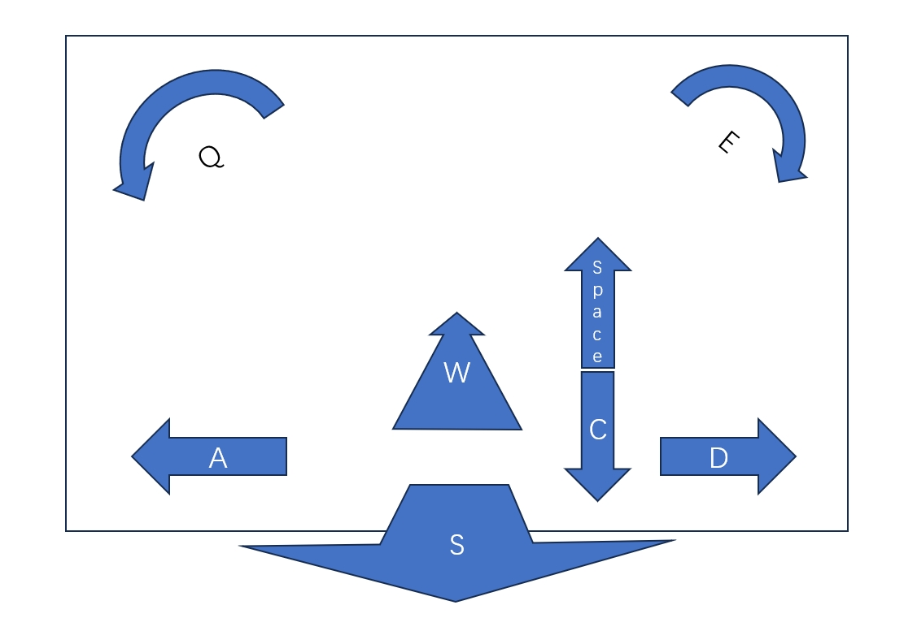

# TurboSplat-Viz

**TurboSplat-Viz** is a 3D Gaussian Splatting (GS) renderer implemented using DirectX 12. Leveraging the exceptional performance of Mesh Shaders, DX12GSViewer achieves unparalleled speed improvements. Compared to traditional GS renderers implemented with CUDA ([reference repository](https://github.com/graphdeco-inria/gaussian-splatting)), which rely solely on GPU compute cores for rendering, DX12GSViewer fully utilizes the GPU graphics pipeline and rasterization capabilities, resulting in a **2.0x–3.0x speedup**.

# Usage

## Configure the GS Scene to Load

Set up your scene in `asset/default_scene.ini`.

*Note: Currently, only spherical harmonic degree (sh_degree) 0 is supported.*

## Controls

# Planned Features

- [x] Configuration file & control support  
- [ ] Support for large scenes (RetinaGS)  
- [ ] Level of Detail (LOD)  